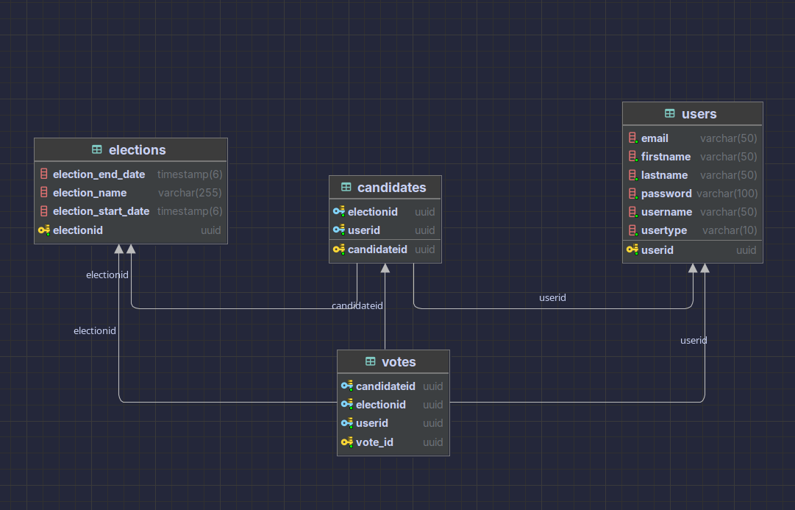

# VOTING SYSTEM

## Description

A voting system where registered users can vote for their preferred candidate.

## Features

- Two user types: admin and normal user.
- Only the admin can add candidates.
- Candidates must be registered as normal users.
- Measures to prevent duplicate voting.
- Logging functionality for server events.
- Secure and unique user authentication.

## Database Model



### Model Explanation

The voting system has three tables:

- **users**: Stores user information.
- **candidates**: Stores candidate information.
- **votes**: Stores vote information.

### Relationships

- **users** and **candidates**: Many-to-many relationship.
- **votes**: Ternary relationship between users, candidates, and elections.

#### Primary Keys and Constraints

- Composite primary key (user_id, election_id) ensures a user can be a candidate only once in the same election.
- Surrogate key candidate_id used as a foreign key in the votes table.
- Unique constraints on (user_id, election_id) ensure a user can be a candidate only once in the same election.
- Unique constraints in the votes table ensure a user can vote only once in the same election and for the same candidate.

## Security

- JWT for authentication and authorization.
- Token validation filter.
- Role-based access control.
- Secret key for signing tokens.
- Unique constraints to prevent duplicate voting and multiple candidacies or votes in the same election.

## Requirements

- Java 22
- Maven
- PostgreSQL

## Installation

- clone the project
- create .env file and add the following variables

```
DB_URL=jdbc:postgresql://localhost:5432/db_name
DB_USER=db_user
DB_PASSWORD=db_password
DB_NAME=db_name
JWT_SECRET=your_secret_key
```

- run the project
- a note : make sure to add the information as i mentioned in the .env file

```
 cd voting-system
 chmod +x build.sh
 ./build.sh
```

## API

```
http://localhost:8080/swagger-ui.html
```

## WEB APP

```
http://localhost:8080/index.html
```
